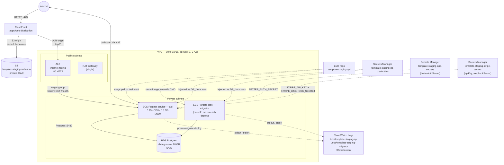
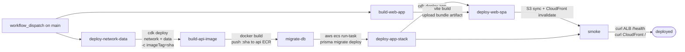

# System design

Current topology of what's deployed. Read alongside `.claude/memory/project_overview.md` (the design intent).

This document covers **staging** only. Production stacks are defined in CDK (`bin/app.ts` instantiates them) but no workflow deploys them.

## AWS infra (staging)



**Security groups**

- `albSg`: inbound `:80` from `0.0.0.0/0`
- `ecsSg`: inbound `:3000` from `albSg` only
- `rdsSg`: inbound `:5432` from `ecsSg` only
- All other inbound denied (default)

**Stacks** (CloudFormation)

- `template-staging-network` — VPC, NAT, security groups
- `template-staging-data` — ECR (api), RDS Postgres, ECS cluster, migrator task definition, Secrets Manager entries (DB credentials + app secrets + stripe secrets)
- `template-staging-app` — Fargate API service + task def, ALB + target group + listener, log group, web SPA S3 bucket + CloudFront distribution

All stacks have `terminationProtection: false` so `cdk destroy "template-staging-*"` tears them down without manual intervention.

## Request paths

Per-route documentation lives in [`docs/endpoints.md`](endpoints.md).

## Deploy flow

Two workflows:

- **`.github/workflows/ci.yml`** — PR + push validation. Jobs: `ci`, `cdk-synth`, `commitlint` (PR), `build-api-image` (PR), `build-web-app` (PR).
- **`.github/workflows/deploy-staging.yml`** — `workflow_dispatch`-only deploy DAG.



- AWS access via OIDC (`AWS_DEPLOY_ROLE_ARN` in the `staging` GitHub Environment). No long-lived keys.
- `deploy-network-data` passes `imageTag` so the migrator task definition references the SHA `build-api-image` is about to push. CFN doesn't validate ECR image existence at deploy time, so referring to a not-yet-pushed tag is fine.
- `migrate-db` invokes `aws ecs run-task` against the migrator task definition, waits for it to stop, and fails the workflow on a non-zero exit (dumping recent migrator logs).
- `deploy-app-stack` uses `cdk deploy --exclusively` so it does not re-confirm the network and data stacks.
- `deploy-web-spa` downloads the artifact, two-pass-syncs to S3 (long-cache + immutable for hashed assets, no-cache for `index.html`), and invalidates `/` + `/index.html` on the CloudFront distribution.
- The smoke step polls the ALB `/health` for up to 5 minutes (asserting `version` matches the pushed SHA) and curls the CloudFront URL asserting the response contains `id="root"`.

## External integrations

### Stripe (optional)

Per-user Stripe subscription. Fork-opt-in — until the Stripe secrets are populated and `STRIPE_PRICE_ID_PRO` context flag is supplied, the billing routes return a clean "billing not configured" 500 and the dashboard renders the paywall state.

```
sign up                          /signup → POST /api/auth/sign-up/email
  ↓
post-signup checkout             POST /api/billing/checkout-session { plan }
  ↓                              → Stripe Checkout URL → window.location
Stripe Checkout completes        customer + subscription created in Stripe
  ↓
Stripe → POST /api/webhooks/stripe   raw-body signature check
                                     → stripe_event id insert (idempotency)
                                     → UPSERT subscription mirror keyed by userId
                                     → link User.stripeCustomerId on checkout.session.completed
  ↓
SPA fetches access-state         /dashboard → flips paywalled→paid
```

- **`packages/billing`** — Stripe SDK wrapper. `getUserAccessState(userId)` is the sole paywall resolver (`paid | past_due | paywalled`). Checkout + Customer Portal helpers. `isBillingConfigured()` predicate gates real Stripe-touching routes.
- **`subscription` table** — Stripe mirror, one row per user (`userId @unique`), UPSERTed by the webhook.
- **`stripe_event` table** — idempotency anchor. Insert before processing; unique-id collision short-circuits Stripe's retries.
- **CDK secrets**: `template-${env}-stripe-secrets` holds `apiKey` + `webhookSecret` (operator-supplied; empty by default). Injected as `STRIPE_API_KEY` + `STRIPE_WEBHOOK_SECRET`. `STRIPE_PRICE_ID_PRO` is fork-supplied via `-c stripePriceIdPro.<env>=price_…`.
- **Customer Portal** handles change-card / cancel / invoices — we don't reimplement any of it. The dashboard's "Manage billing" button mints a Portal session.
- **Local dev** uses Stripe test mode + the Stripe CLI (`stripe listen --forward-to localhost:3000/api/webhooks/stripe`). See [`docs/runbooks/billing-smoke.md`](runbooks/billing-smoke.md).

## What is NOT deployed

- HTTPS on the ALB, Route53, ACM, custom domain (SPA served from CloudFront's default `*.cloudfront.net`; API direct ALB DNS over HTTP for /health probe)
- Production env (stacks synth but no workflow deploys them)
- IAM tightening (deploy roles still hold broad permissions — see [`docs/runbooks/github-oidc-setup.md`](runbooks/github-oidc-setup.md))
- Sentry, CloudWatch alarms, dashboards
